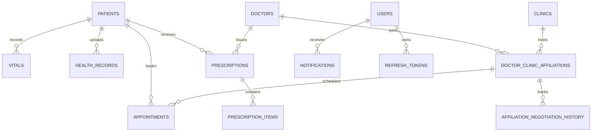

# Khoj - Healthcare Management Platform 🏥

[](https://spring.io/projects/spring-boot)
[](https://www.oracle.com/java/)
[](https://supabase.com/)
[](https://khoj-the-ultimate-guide.onrender.com)
[](LICENSE)

**Khoj** is an enterprise-grade healthcare management backend engineered to streamline affiliations, appointments, digital prescriptions, health records, and communication between **Patients**, **Doctors**, and **Clinics**.

---

## 🌐 Live Cloud Deployment

| Service | Host | Status | Link |
| :--- | :--- | :--- | :--- |
| **Backend API** | Render |  | [https://khoj-the-ultimate-guide.onrender.com](https://khoj-the-ultimate-guide.onrender.com) |
| **Interactive Swagger Docs** | Render |  | [Swagger UI](https://khoj-the-ultimate-guide.onrender.com/swagger-ui/index.html) |
| **Database** | Supabase (AWS ap-southeast-1) |  | Supabase Cloud |

---

## 🚀 Key Modules & Capabilities

### 🧑‍⚕️ For Patients
- **Profile & Health Data:** Manage personal details, blood group, emergency contacts, vitals history, and uploaded lab/imaging records.
- **Doctor & Clinic Discovery:** Search healthcare providers by doctor specialization or clinic location.
- **Appointment Booking:** Real-time appointment scheduling with token numbering and status tracking.
- **Prescription Tracking:** View digital prescriptions, active medication regimens, start dates, and instructions.
- **Notifications & Alerts:** In-app notification center for appointment reminders, lab reports, and doctor schedules.

### 👨‍⚕️ For Doctors
- **Profile & Credentialing:** Verification details including registration number, council issue date, specializations, and qualifications.
- **Affiliation Negotiation Engine:** Send, counter-propose, approve, or reject affiliation agreements with clinics (including doctor fees, clinic charges, and daily patient quotas).
- **Practice Dashboard:** Aggregated metrics for daily appointments, active patient consults, and schedule calendar.
- **Digital Prescriptions:** Issue itemized prescriptions with dosage, frequency, course duration, and discontinue reasons.

### 🏥 For Clinics
- **Facility Management:** Multi-location schedule management (weekly operating hours per day), contact numbers, and website links.
- **Doctor Roster:** Manage affiliated doctors, counter-negotiate consultation fees, and control patient queues.
- **Clinic Dashboard:** Clinic operational analytics, doctor roster count, and daily patient capacity metrics.

---

## 🛠️ Technology Stack

- **Framework:** Spring Boot 3.3.5 (Java 21)
- **Security:** Spring Security 6, Stateless JWT (Access + Refresh Token rotation with token revocation), BCrypt password hashing
- **Persistence & ORM:** Spring Data JPA, Hibernate ORM 6.5
- **Database:** PostgreSQL (Supabase Cloud with connection pooling) / H2 in-memory (local development)
- **Containerization:** Multi-stage Docker image (Alpine JRE 21)
- **API Documentation:** SpringDoc OpenAPI 3 / Swagger UI 2.5.0
- **Object Mapping & Utilities:** ModelMapper 3.2.0, Lombok, Jakarta Validation

---

## 🏗️ Architecture & Database Entities

The application consists of 12 strongly typed, normalized PostgreSQL tables:



---

## 💻 Local Setup & Development

### Prerequisites
- **JDK 21** or later
- **Maven 3.9+** (or use included `./mvnw`)
- **Docker** (optional, for container runs)

### 1. Clone Repository
```bash
git clone https://github.com/rohannc/Khoj-The_Ultimate_Guide.git
cd Khoj-The_Ultimate_Guide
```

### 2. Run with Local In-Memory Database (H2)
No external database installation needed:
```bash
./mvnw spring-boot:run
```
- API will start on: `http://localhost:8080`
- Local H2 Console: `http://localhost:8080/h2-console` (`JDBC URL: jdbc:h2:mem:khojdb`, user: `sa`, no password)
- Local Swagger: `http://localhost:8080/swagger-ui/index.html`

### 3. Run with Supabase Cloud PostgreSQL
```powershell
$env:SPRING_PROFILES_ACTIVE="supabase"
$env:SPRING_DATASOURCE_URL="jdbc:postgresql://<pooler-host>:5432/postgres?sslmode=require"
$env:SPRING_DATASOURCE_USERNAME="postgres.<project-ref>"
$env:SPRING_DATASOURCE_PASSWORD="<db-password>"

./mvnw spring-boot:run
```

---

## 🔑 Default Seeded Accounts

For testing, the database includes pre-seeded user accounts (password for all seeded accounts is `Password@123`):

| Role | Username | Password | Notes |
| :--- | :--- | :--- | :--- |
| **Patient** | `aarav.sharma` | `Password@123` | Patient profile with vitals and prescriptions |
| **Doctor** | `dr.rajesh.gupta` | `Password@123` | Cardiologist with active clinic affiliations |
| **Clinic** | `apollo.bandra` | `Password@123` | Multi-specialty clinic with operational timings |
| **Patient (Default)** | `patient` | `Password@123` | Auto-generated by startup runner |
| **Doctor (Default)** | `doctor` | `Password@123` | Auto-generated by startup runner |
| **Clinic (Default)** | `clinic` | `Password@123` | Auto-generated by startup runner |

---

## 📡 API Endpoints Overview

| Module | Method | Endpoint | Access |
| :--- | :--- | :--- | :--- |
| **Auth** | `POST` | `/api/auth/register` | Public |
| **Auth** | `POST` | `/api/auth/login` | Public |
| **Auth** | `POST` | `/api/auth/refresh` | Public |
| **Patients** | `GET` / `PUT` | `/api/patients/{id}` | Patient / Admin |
| **Doctors** | `GET` / `PUT` | `/api/doctors/{id}` | Public (Read), Doctor (Write) |
| **Clinics** | `GET` / `PUT` | `/api/clinics/{id}` | Public (Read), Clinic (Write) |
| **Affiliations** | `POST` / `PATCH` | `/api/affiliations` | Doctor, Clinic |
| **Appointments** | `GET` / `POST` / `PATCH` | `/api/appointments` | Patient, Doctor, Clinic |
| **Prescriptions** | `GET` / `POST` / `PATCH` | `/api/prescriptions` | Patient, Doctor |
| **Health Records**| `GET` / `POST` | `/api/health-records` | Patient, Doctor |
| **Vitals** | `GET` / `POST` | `/api/vitals` | Patient, Doctor |

Complete interactive schemas are available in [Swagger UI](https://khoj-the-ultimate-guide.onrender.com/swagger-ui/index.html).

---

## 📦 Docker & Cloud Deployment

### Build and Run Docker Locally
```bash
docker build -t khoj-backend .
docker run -p 8080:8080 -e SPRING_PROFILES_ACTIVE=supabase khoj-backend
```

### Deploying to Render
1. Connect your GitHub repository to Render.
2. Choose **Docker** runtime.
3. Configure environment variables (`SPRING_PROFILES_ACTIVE`, `SPRING_DATASOURCE_URL`, `SPRING_DATASOURCE_USERNAME`, `SPRING_DATASOURCE_PASSWORD`).
4. Render automatically builds the multi-stage Docker image and deploys.

---

## 📜 Commit Message Conventions

This project enforces a strict, capitalized commit convention:

```
Type ( Scope ) : Description
```
*or*
```
Type : Description
```

### Rules:
- **Type**: Capitalized (e.g. `Feat`, `Fix`, `Refactor`, `Perf`, `Docs`, `Chore`, `Test`).
- **Scope** *(Optional)*: Capitalized inside parentheses with spaces (e.g., `( Docker )`, `( Config )`, `( Auth )`).
- **Separator**: Space colon space (` : `).
- **Description**: Capitalized first letter describing the change clearly.

### Examples:
- `Feat : Complete health records, prescriptions, notifications, and affiliation history`
- `Fix ( Docker ) : Simplify Dockerfile build stage and remove .mvn ignore`
- `Refactor ( Config ) : Remove redundant dialect and streamline auth provider bean`
- `Perf ( Pooler ) : Add keepalive-time and tune connection lifetimes for cloud pooler`

---

## 📄 License

This project is licensed under the MIT License. See [LICENSE](LICENSE) for details.
